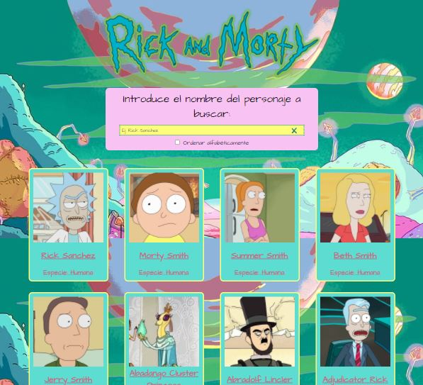
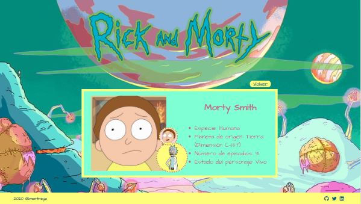

# Módulo 3: Evaluación final en [Adalab](www.adalab.es)

El ejercicio consiste en desarrollar una página web con React, consistente en un listado de personajes de Rick and Morty que podemos filtrar por el nombre del personaje.
Clickando en la tarjeta del personaje deseado podemos acceder a la tarjeta de detalle de éste con información más extendida.

## Código

### Componentes

Para realizar el ejercicio se han utilizado cinco componentes:

- App.js: Componente raíz, guarda en su estado toda la información de la app web. Asimismo, recibe por lifting información de acciones del usuario en la interfaz y opera con esta información.

- CharacterList.js: Componente secundario, se encarga de filtrar y mapear el array de resultados con la información de los personajes. Para renderizarlo utiliza la estructura del componente CharacterCard.js (BONUS): El listado aparece ordenado alfabéticamente, cuando la búsqueda no encuentra resultados se muestra un mensaje de error al usuario, añadido un preventDefault() para evitar el comportamiento por defecto del enter en el input.

- CharacterCard.js: Contiene la estructura de renderizado y recibe por props de CharacterList.js la información del array de personajes para renderizarse (nombre, dibujo del personaje y especie).

- Filters.js: Contiene un formulario con un input de texto y otro de tipo botón. En el input de texto el usuario escribirá el nombre del personaje que desea consultar y los resultados mostrados se irán filtrando a medida que el usuario escriba. El input de botón cumple la función de limpiar el campo de búsqueda. (BONUS): La búsqueda se realiza sin distinguir entre mayúsculas y minúsculas, el formulario debe estar recubierto por una etiqueta form.

- CharacterDetail.js: Es el componente encargado de renderizar la tarjeta de detalle del personaje seleccionado. Utiliza react-dom-router y recibe por props el array de personajes y el id único diferenciador de cada personaje mediante match. Cuando el usuario hace click en una tarjeta, CharacterDetail.js recibirá el array de personajes y el id diferenciador del que se ha clickado para filtrar y renderizar la información. (BONUS): La URL es compartible y en caso de introducir una inexistente la página muestra un mensaje de error al usuario y un botón con el que se accede de nuevo a la página de resultados.

### Stylesheets

Se han creado cinco hojas de estilos utilizando SASS, correspondiendo con los cinco componentes anteriormente listados y conteniendo todos los estilos de éstos. Además, existe una hoja adicional index.scss que contiene los estilos de index.js

La maquetación de este ejercicio es libre y para llevarla a cabo se ha tomado en consideración la paleta de colores y diseños generalmente utilizados en la serie.

(BONUS): En el CharacterDetail.js, se muestra la especie y el estado de un personaje por escrito y con iconos, se ha utilizado un sistema de grid para mostrar la lista de resultados de personajes, ejercicio responsive en mobile first, con breakpoint a tablet (768px) y desktop (1200px).

### Services

La carpeta Services contiene al módulo encargado de realizar la petición a la API. Posteriormente este servicio es importado a App.js, donde se guardan en el estado estos resultados.
Al fetch se le ha añadido un catch para mostrar un mensaje al usuario si ha habido algún problema con la carga de los resultados. Además, se le ha añadido un sistema de loading para los casos de conexión lenta.

## Interfaz

Página principal:

Página de detalle de personaje:

@martreyz 🐈
